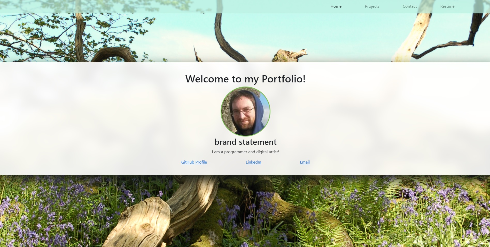

# React Portfolio - Pete Andrew

## Description:

This app is a portfolio website written using React and router. The projects page dynamically displays various projects that I have completed, the information for these components is stored as a JSON file.

## Table of Contents:

- [Description](#description)
- [Installation](#installation)
- [Usage](#usage)
- [licence](#licence)
- [Contributing](#contributing)
- [Tests](#tests)
- [Questions](#questions)

## Installation:

webpage

https://react-portfolio-pete-andrew.netlify.app

## Usage:

N/a

## Licence:

This product is licenced under the MIT licence.

## Contributing:

N/a

## Screenshot: 

## Tests:

N/a

## Questions:

If you would like to learn more about this project or my programming please see the following GitHub:

https://github.com/Pete-Andrew

If you would like to contact me please use the following email address:

peter.a.andrew@gmail.com
